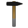

# Mesh Proc™  
Simple Triangle Mesh Processor.

This project does not want to provide a ton of different functions,
but only important core functions with optimized implementations.
It's not aiming to replace [OpenSCAD](https://github.com/openscad/openscad) or [MeshLab](https://github.com/cnr-isti-vclab/meshlab).
It's aiming to complement those in a greater processing pipeline.

## Development & Work-In-Progress Notes:

### Senarios

- Scriptable, e.g. yaml
[/] load multiple meshes, place them, save one combined mesh
- Boolean mesh combiners: A-B subtract, A^B intersection
	- Note: only B needs to be watertight to provide a clean definition of "inside"
- Mega-Heal: Auto cleanup of meshes with the option to force them to be watertight
	- automatically remove non-manifold geometry
	- automatically close (small) holes
- Manual fixing:
	- select open edge loops, intersection-free
	- linear-extrude loop (including chamfer)
	- close loop hole (non-convex, intersection-free loops) if planar, and if non-planar
- Cookie-cutter: cut in holes, dents, add triangulation
- Stitch/connect mesh holes
- partially morph/blend meshes (create seamless connections) and merge meshes by re-meshing
- free deform meshes with a tri-linear, tri-quadratic, or tri-cubic volume
- shear and tighten meshes
- select vertices, faces, edges
- break edges (and corners)
- Later: spring-mass-sim deformation
  -> Golem
  -> Skeletor
  -> ...

### Concept
- Manual live interaction
- Action script is automatically built&synced, saved, loaded and replayed, etc.
- 3d view based on an engine, e.g. Godot or helix?

## Alternatives
Inspired by
- [MeshLab -- https://github.com/cnr-isti-vclab/meshlab](https://github.com/cnr-isti-vclab/meshlab)
- [OpenSCAD -- https://github.com/openscad/openscad](https://github.com/openscad/openscad)
- [VCGlib -- https://github.com/cnr-isti-vclab/vcglib](https://github.com/cnr-isti-vclab/vcglib)

## License
This project is freely available as open source under the terms of the [Apache License, Version 2.0](LICENSE)

> Copyright 2025 SGrottel (www.sgrottel.de)
>
> Licensed under the Apache License, Version 2.0 (the "License");
> you may not use this file except in compliance with the License.
> You may obtain a copy of the License at
>
> http://www.apache.org/licenses/LICENSE-2.0
>
> Unless required by applicable law or agreed to in writing, software
> distributed under the License is distributed on an "AS IS" BASIS,
> WITHOUT WARRANTIES OR CONDITIONS OF ANY KIND, either express or implied.
> See the License for the specific language governing permissions and
> limitations under the License.
